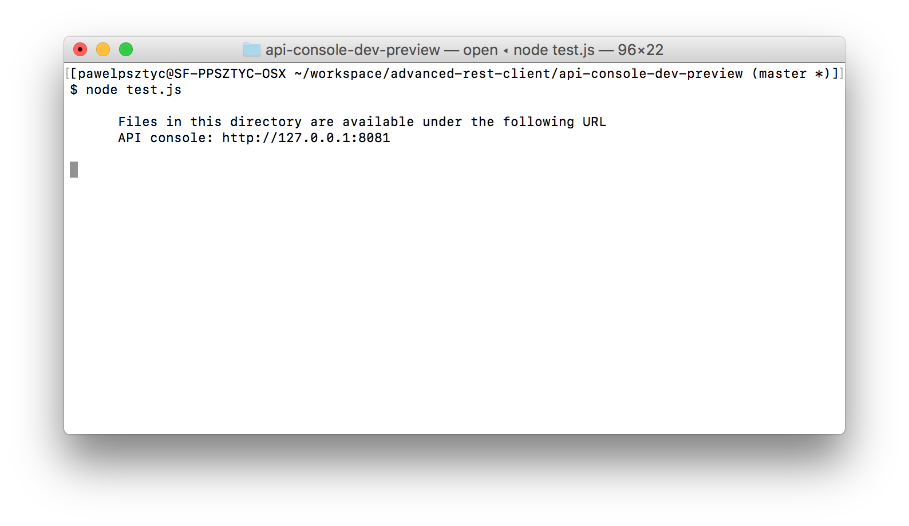
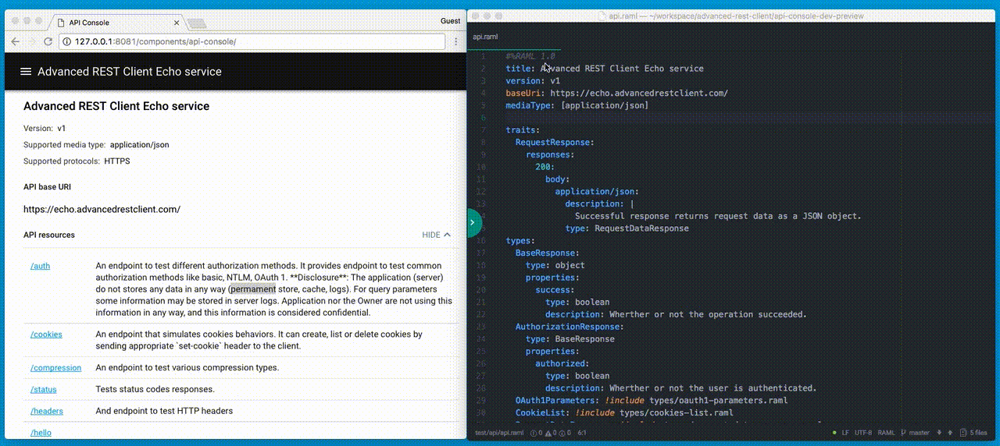

# api-console-dev-preview

A npm module to generate API console dev version from RAML files and update RAML data every time the sources change.

It runs development version of the API console (without optimization for production)
with RAML documentation from pointed directory and observes this directory for changes.
Each time any file changes it updated the API console without reloading it.

## Example

```javascript
const {ApiConsoleDevPreview} = require('api-console-dev-preview');

const server = new ApiConsoleDevPreview({
  projectRoot: '/path/to/api/directory/',
  api: 'my-api.raml',
  src: '/console/sources/api-console-full.zip',
  sourceIsZip: true,
  noBower: true,
  verbose: true,
  open: true
});
server.run();
```

Script above runs a web server with the API console and observes `/path/to/api/directory/`
path for any change. If content of the directory change then the console
is updated without reloading the page.

The `api-console-full.zip` file contains API console sources with installed
bower components. With `noBower` is significantly speeds up start time.
If this values are not specified then the module downloads API console sources
from GitHub and installs bower dependencies. Note that this operation may take
several seconds to finish.

The `open` option tells the server running script to open default browser with
the API console url.

### Options

Some of the options are the same as in the [api-console-builder][1] module.

| Option | Type | Default | Description |
| ---- | ---- | ---- | ---- |
| `api` | `String` | `api.raml` | The RAML entry point file. |
| `host` | `String` | `undefined` | Host name of the web server. |
| `noBower` | `Boolean` | `false` | If set to `true` it skips bower components installation. Use it if `src` points to an `api-console` sources with all dependencies installed. |
| `open` | `Boolean` | `false` | If set it opens browser window when console is ready. |
| `port` | `Number` | `undefined` | Port name of the server. |
| `projectRoot` | `String` | Current working directory | API project folder location. |
| `sourceIsZip` | `Boolean` | `false` | Determines that local API console source is in zip file. See also [api-console-builder][1] options. |
| `src` | `String` | `undefined` | API console sources in local or remote location. If sources are at remote location it must be a zip file. See also [api-console-builder][1] options. |
| `tagVersion` | String | `undefined` | A release tag name to use. With this option the builder uses specific release of the console. If not set and `src` is not set it uses latest release. Note, only versions >= 4.0.0 can be used with this tool. See also [api-console-builder][1] options. |
| `verbose` | `Boolean` | `false` | Prints debug messages |

### API console sources resolution

By default the module downloads latest release of the console from GitHub and use
it to generate the preview.

If custom version of the console is to be used to generate the preview or to reduce startup time
use the `src` option to point to console's release.

-   If it points to a local directory it's content will be copied to web server destination.
-   If it points to a local zip file set `sourceIsZip` option. Zip file content will be
extracted to server's working directory.
-   If it points to a remote location the module expects it to be a zip file (`sourceIsZip`
option is then assumed by default).

```javascript
const options = {
  src: '/console/sources/api-console.zip',
  sourceIsZip: true, // false by default, for directories with extracted console
};
```

API console downloaded from GitHub required to install bower dependencies. When
server startup command is called the script runs `bower install` command to
download the dependencies. Bower is installed by the script locally.
This operation may take several seconds. If that's a limitation for some use
cases then you can prepare a zip file with console's source code and installed
bower components. In this case set `noBower` option to prohibit downloading
the dependencies.

```javascript
const options = {
  src: 'api-console-full.zip',
  sourceIsZip: true,
  noBower: true
};
```

Additionally the module can download specific release of the console.  Use `tagVersion`
option for that.

```javascript
const options = {
  tagVersion: 'v4.0.0'
};
```

## Using the module

After running the start command the process continue in background. Info message
is printed to the terminal with the address of the API console:



To terminate the thread and clean up allocated resources press `ctrl + c`.

When the command is running it observes path specified in the `projectRoot` option.
Whenever file is changed, added or deleted the module regenerates data used by
the console and sends it to the console.



[1]: https://github.com/mulesoft-labs/api-console-builder#options
